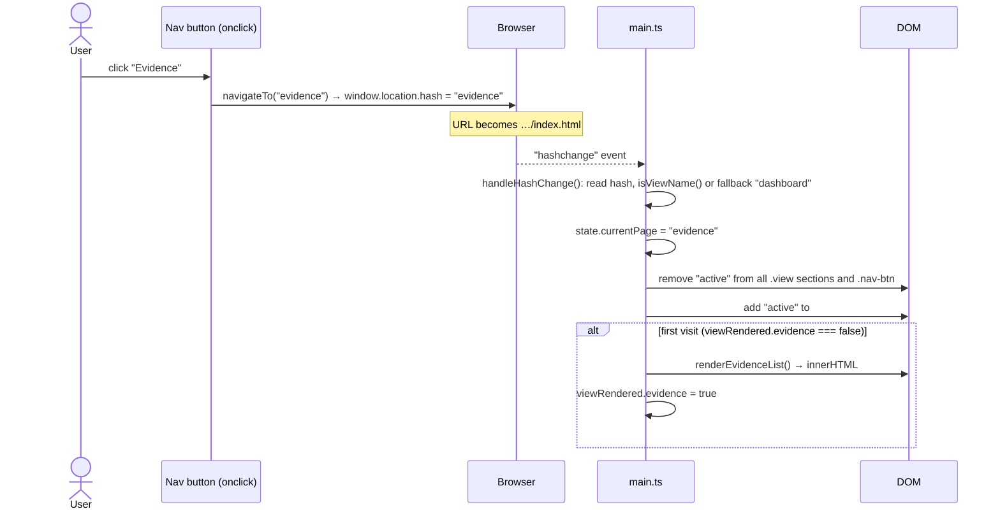

# Exercise 3 — Change log, demo instructions & answers

React foundations and the first migration step (application shell + Dashboard).

Every demo below has three parts:

- **What I did / what to show**: the result and where it lives.
- **How to demo (step by step)**: what to click/type in class.
- **Answers**: to the questions in `EXERCISES/EXERCISE_3.md`.

Commits (`git log --oneline`):

| Commit message | Demo |
|---|---|
| `EX3 DEMO 5/6: Add React + TSX to the Vite project with a separate entry page` | 5, 6 |
| `EX3 DEMO 9: Migrate the application shell to React` | 9 |
| `EX3 DEMO 10: Migrate the Dashboard view to React` | 10 |
| `EX3 DEMO 7/8: Component hierarchy, ADR and notes` | 1–4, 7, 8 (docs) |

## Preparation before class (do this once)

```bash
git pull
npm ci
npm run dev        # opens http://localhost:5173
```

- Vanilla app (unchanged): <http://localhost:5173/index.html>
- React version: <http://localhost:5173/react.html>
- Live (after merging to `main`): `https://alfonso-dv.github.io/awb_exercise1_devera/` and
  `https://alfonso-dv.github.io/awb_exercise1_devera/react.html`
- Have **Chrome DevTools** ready, plus the **React Developer Tools** extension (Components tab).
  It's optional but very useful for Demos 5, 9 and 10.
- Clear `localStorage` before the demo (DevTools → Application → Local Storage → right-click →
  Clear) so the numbers start at 0 bookmarks.

---

# DEMO 1 — Historical view of the web

## Timeline (concise)

| Era | Typical approach | What the browser gets / does |
|---|---|---|
| **~1991–1995 Static documents** | Hand-written HTML files, hyperlinks | A complete document per URL. No interactivity. |
| **~1995–2004 Server-generated pages (CGI, PHP, ASP, JSP)** | Server renders HTML per request from a database; forms POST back | Every click = full page reload. All state lives on the server/in the URL. JavaScript only for small effects ("DHTML"). |
| **~2005–2010 AJAX / Web 2.0** | `XMLHttpRequest` (Gmail 2004, Google Maps 2005), jQuery (2006) | Server-rendered page + JavaScript that fetches data in the background and patches parts of the DOM, with no full reload. |
| **~2010–2014 First SPA frameworks** | Backbone, AngularJS, Ember; **hash routing** (`#/inbox`), later the History API | One HTML shell; JS renders all views, routing happens in the browser, the server only sends JSON. |
| **~2013–today Component era** | React (2013), Vue (2014), Angular 2+, Svelte; virtual DOM / compilers; build tools (webpack → Vite) | Declarative components: UI = f(state). Bundlers, TypeScript, npm. |
| **~2016–today Hybrid / "back to the server"** | Next.js, Nuxt, Remix, Astro; SSR + hydration, static generation, islands, React Server Components | Server/build renders HTML for fast first paint, the client takes over for interactivity. |

## Where this app sits

**Original version (before Exercise 1): "late AJAX / early SPA" (~2010–2012 style).**

- One static `index.html` shell that contains all 5 views as hidden `<section>`s.
- Data loaded with `fetch()` (the modern AJAX) as JSON and turned into HTML with string
  concatenation and `innerHTML`, very much like jQuery-era templating.
- Hand-written **hash routing** (`#dashboard`, `#evidence`) with no full reload: the trademark of
  early SPAs (Backbone/AngularJS 1).
- No framework, no components, global variables, one big script.

**After Exercise 2:** same architecture, but with modern *tooling* (ES modules, npm, Vite,
TypeScript, CI/CD). **After Exercise 3:** moving into the **component era** (React), still purely
client-side rendered (no SSR). So it's an early-SPA architecture that is now being moved into
the component era.

## How to demo

1. Show the table above (or draw the timeline on the board).
2. Open `git show 22cb2d8:app.js | less` (the original file): point at `handleHashChange()` (hash
   routing), the `fetch(...)` calls and `container.innerHTML = html` (AJAX-style rendering).
3. Open `index.html` and show that all 5 views are already in the one HTML file as hidden sections.
4. Then open `src/react/App.tsx` to show where the app is heading.

## Answers

**What problem did AJAX/jQuery solve, and what new problems did it create?**
With server-rendered pages, *any* change (submitting a comment, loading the next page of results,
filtering a list) meant a **full round trip and a full page reload**: blank screen, scroll position
lost, all page state lost, the whole HTML re-sent. AJAX let the page **request just the data in
the background and update only part of the page**, so the app stayed interactive (Gmail, Google
Maps). jQuery made this practical by smoothing over browser differences (DOM API, events, XHR).
New problems:

- **State now lives in two places** (server and the DOM/JS), and keeping them in sync is manual.
- **Imperative DOM manipulation everywhere** ("find this element, change that text"): spaghetti
  code, the same data rendered in several places that drift out of sync, memory leaks from
  event handlers.
- **No structure** for larger apps (no modules, components, routing). The back button and URLs
  stopped working because content changed without the URL changing, and search engines couldn't
  see content loaded later.

SPA frameworks answered this with structure: client-side routing that keeps URLs/history working,
templates or components bound to data (declarative rendering instead of manual DOM patching),
and modules.

**Hash routing: which era, and what does it tell us?**
That's the **early SPA era (~2009–2013)**: Gmail's `#inbox`, Twitter's `#!/` "hashbang" URLs,
Backbone's and AngularJS's default routers. Changing only the fragment (`#...`) never triggers a
request to the server, fires a `hashchange` event and creates a history entry, and it worked in
every browser **before the HTML5 History API (`pushState`) was widely supported** (IE10, ~2012).
It became common once apps wanted multiple "pages" without reloading, and it's still handy for
static hosting (GitHub Pages) because the server only ever sees `/index.html`. Modern routers
default to `pushState` with clean paths, which needs a server/host that serves `index.html` for
every path.

---

# DEMO 2 — SSR vs. CSR

## Comparison table

| | **Server-Side Rendering (SSR)** | **Client-Side Rendering (CSR)** |
|---|---|---|
| Server sends on first request | **Complete HTML with the content** already in it (plus CSS, and optional JS) | An (almost) **empty HTML shell** (`<div id="root">`) + links to JS bundles |
| Before the user sees content | Download HTML → parse → paint. Content is visible as soon as the HTML/CSS arrives. With hydration, JS then loads and makes it interactive. | Download HTML → download **JS** → parse/execute JS → JS **fetches data** (another round trip) → JS builds the DOM → paint |
| Subsequent navigation | Classic: a new request and a **full new page** from the server. Hybrid frameworks: client-side navigation after the first load. | **No new page**: JS swaps the view in place, only fetches data (JSON) if needed |
| Time to first content | Fast | Slower (JS + data waterfall) |
| No JavaScript / crawlers | Content visible / indexable | Blank page (crawlers that don't run JS see nothing) |
| Server cost | Renders HTML per request (or at build time for SSG) | Static files only; work happens on the user's device |
| Interactions after load | Reload or hydration needed | Fast, rich, stateful |

## Real website: Wikipedia is (primarily) SSR

Evidence you can show live (I couldn't open external sites from my environment, so **do these steps
yourself before class and take screenshots**):

1. Open any article, e.g. `https://en.wikipedia.org/wiki/Single-page_application`.
2. **View page source** (`Ctrl+U`): the full article text (all paragraphs, headings, links) is
   already in the HTML response. Search the source (`Ctrl+F`) for a sentence from the article
   and it's there.
3. **DevTools → Network → Doc**, reload: the first response (the document) is large (tens to
   hundreds of kB) and its *Preview* tab already shows the readable article.
4. **DevTools → Settings → Debugger → Disable JavaScript**, reload: the article is still fully
   readable. Only extras (some menus, previews) stop working.
5. Click another article link: the whole page reloads (a new document request in the Network tab).

→ The server sends finished HTML, the content doesn't depend on JS, and navigation is full page
loads: **SSR**.

(Optional contrast: a CSR example is **this app**, see below. Another well-known example is
Google Maps or a Vite/CRA React app. View source shows only a root `<div>` and script tags.)

## Is this app SSR or CSR? → CSR

`index.html` contains the static *skeleton* (header, empty view sections, empty
`<div id="dashboardContent">`). **All case content is produced in the browser by JavaScript.**
`react.html` is even more extreme: just `<div id="root"></div>`.

Step by step (React version, `react.html`), from request to visible Dashboard:

1. Browser requests `react.html` → GitHub Pages returns ~0.7 kB of HTML with an empty `#root` and
   a `<script type="module" src="assets/react-<hash>.js">` (+ CSS link).
2. Browser parses the HTML, starts downloading CSS and the JS bundle (~228 kB, 71 kB gzipped).
   **Screen shows nothing** (white page) until the next steps finish.
3. JS bundle is downloaded, parsed and executed: `main.tsx` → `createRoot(#root).render(<App />)`.
4. `<App />` renders for the first time: header + nav + `LoadingState` (spinner). **First paint
   with any content.**
5. After that first render, the `useEffect` in `useCaseData()` starts **5 parallel `fetch()`es**
   (`data/case.json`, `people.json`, `locations.json`, `evidence.json`, `timeline.json`).
6. When all 5 responses have arrived and been parsed, `setState({status: "ready", data})`
   triggers a re-render: `DashboardPage` computes the stats and React creates the Dashboard DOM.
   **Now the Dashboard is visible.**

(Vanilla `index.html`: same idea, but the static header/how-to card is in the HTML, so it's
visible after step 2. Data loads in 3 stages: case/people/locations → evidence and timeline, with
re-renders after each.)

**One real cost:** content only appears after **HTML → JS → data**, three dependent network
steps plus JS execution:

- **JavaScript disabled:** `react.html` shows a blank page (just the `<noscript>` text). The
  vanilla page shows an empty shell with a loading overlay that never goes away.
- **Slow connection / slow phone:** the user stares at a white page while 71 kB of gzipped JS
  downloads and parses, *then* waits for the JSON. With SSR the summary text would already be in
  the first response.
- **Search crawlers / link previews** (Slack, social media) that don't execute JS see no case
  content at all.

For this app that's acceptable (a private investigation tool, not a public site), but it's the
price of CSR.

## How to demo

1. **Table:** show the table above.
2. **Wikipedia:** show your screenshots or do it live (view source, Network tab, JS disabled).
3. **This app, CSR proof:**
   - Open `react.html`, press `Ctrl+U`: the source has only `<div id="root"></div>`.
   - DevTools → Network, reload: first `react.html` (tiny), then the JS bundle, *then* the 5
     `data/*.json` requests (show the waterfall, where the JSON starts only after the JS).
   - DevTools → Settings → Debugger → **Disable JavaScript**, reload `react.html` → blank page;
     reload `index.html` → empty skeleton with a spinner forever. Re-enable JS afterwards.
   - Optional: Network → throttling "Slow 3G" and reload to make the white-page time visible.
4. Walk through the 6 steps above using `src/react/main.tsx` → `App.tsx` → `useCaseData.ts`.

---

# DEMO 3 — The virtual DOM

## In my own words

The virtual DOM is a **plain JavaScript object tree that describes what the UI should look like**
(element type, props, children). It's cheap to create and compare, unlike real DOM nodes. When
state changes, the library builds the *new* description, **compares it with the previous one
(diffing)** and then makes only the **minimal set of real DOM changes** needed (change one text,
toggle one class). It lets you write UI *declaratively* ("for this state, the UI looks like
this") while the library works out *how* to update the page efficiently and without losing
things like focus, scroll position or input contents.

## Example from the original `app.js`

Commit `22cb2d8` (template), `app.js`:

```bash
git show 22cb2d8:app.js | sed -n 369,449p
```

- `handleBookmarkClick(evidenceId)` (line 434) changes **one** thing: the bookmark state of one
  item (`bookmarks` array + `ev.bookmarked`).
- It then calls `renderEvidenceList()` (line 448 → 369), which rebuilds the HTML string for
  **every** card via `renderEvidenceCardHTML()` (line 397) and assigns
  `container.innerHTML = html` (line 390).

Measured in the browser: the evidence list has **217 elements (18 cards)**. One bookmark click
**destroys and recreates all 217**, although only **one button's class (`active`) and one
character (☆ → ★)** actually change. (Side effects: hover/focus state on the button is lost,
screen readers lose their position, and all child nodes are garbage collected.)

## How to demo

1. `git show 22cb2d8:app.js | sed -n 369,449p` and walk through `handleBookmarkClick` →
   `renderEvidenceList` → `innerHTML`.
2. In the vanilla app (`index.html#evidence`), DevTools → **Elements**, expand
   `#evidenceList`, then click a bookmark star: **every card is highlighted/flashes** (Chrome highlights
   DOM nodes that were changed or re-created) → the whole list was rebuilt.
3. Optional proof in the Console:
   ```js
   let n = 0; new MutationObserver(m => m.forEach(r => n += r.addedNodes.length))
     .observe(document.getElementById("evidenceList"), {childList: true, subtree: true});
   // click one bookmark star, then:
   n   // → 18 (all cards were replaced)
   ```
4. Contrast with React: in `react.html`, DevTools → Elements, switch between views and back.
   Only the changed part of `<main>` flashes. (With React DevTools → ⚙ → "Highlight updates
   when components render" you can see which components re-render.)

## Answers

**How would a virtual-DOM approach avoid recreating the unchanged parts?**
Each card would be a component, e.g. `<EvidenceCard key={ev.id} evidence={ev}
bookmarked={...} />`. After the click, the new virtual tree is built and compared with the old
one. The `key`s let the diff match card E03 to card E03. For 17 cards the description is
identical, so **nothing** is touched in the real DOM. For the clicked card the diff finds exactly two
differences: the button's `className` (`"bookmark-btn"` → `"bookmark-btn active"`) and the text
`☆` → `★`. So it does `button.className = …` and `textNode.data = …`. 2 DOM operations instead of
recreating 217 elements.

**Is the virtual DOM "faster" than `innerHTML`?**
Not by itself. It's a trade-off: the VDOM does **extra work in JavaScript** (create the new tree
on every render, then diff it) to **save work in the real DOM** (which is expensive: layout,
style recalculation, node creation, GC). For a big list where little changes, that trade pays off.
For a first render, or when *everything* changes, a single `innerHTML` (one HTML parse, done in
optimized native code) can be just as fast or faster, because the VDOM still has to build and
diff everything first. And hand-written targeted DOM updates (`button.classList.add("active")`)
are always faster than both. The real win of the VDOM is that you get *reasonably efficient
updates automatically while writing simple declarative code*, plus preserved DOM state (focus,
inputs, scroll). Svelte/Solid show you can even skip the VDOM via compile-time tracking.

**Does a VDOM library make the app fast automatically? What can still be slow?**
No. Common causes of slow React apps:

- **Unnecessary re-renders**: state kept too high up the tree, so one keystroke re-renders the
  whole app. New object/function props on every render break `memo`. Context values that change
  constantly.
- **Expensive work during render**: filtering/sorting large arrays on every render without
  `useMemo`. Heavy computations in components.
- **Huge DOM**: rendering 10,000 rows instead of virtualizing the list. The diff is fast, but
  the DOM itself is big.
- **Bad keys** (index as key in reordered lists): React re-creates or mis-matches elements.
- **Large bundles / waterfalls**: lots of JS to download and parse, data fetched in a chain of
  effects, no code splitting.
- **Effects that loop or cause layout thrashing**, and synchronous blocking work on the main thread.

---

# DEMO 4 — SPA vs. MPA: state & routing

## How navigation works now (vanilla app)



**What does *not* happen** (compared with a classic multi-page site):

- no HTTP request for a new HTML document, and no new HTML/CSS/JS download or parse,
- no blank screen / full repaint, and the JS runtime is **not** restarted,
- in-memory state (`state` object, loaded data, filter values, open detail) is **not** thrown
  away,
- the JSON data is **not** fetched again (it was loaded once at startup).

## State: lost vs. preserved on a full reload (F5)

| State | Where it lives | After reload |
|---|---|---|
| Bookmarks | `localStorage["remotion_bookmarks"]` | ✅ kept |
| Saved notes per evidence | `localStorage["remotion_notes"]` | ✅ kept |
| Saved hypothesis draft | `localStorage["remotion_hypothesis"]` | ✅ kept (only if "Save" was clicked) |
| Current view | URL hash (`#evidence`) | ✅ kept (the URL is reloaded) |
| Loaded case data (`allEvidence`, `allPeople`, …) | memory (`state`) | ⚠️ lost, **re-fetched** from JSON |
| **Review status / relevance changes** (detail view dropdowns) | memory only (mutates `ev.status`) | ❌ **lost**: back to the JSON values |
| Search text, 5 evidence filters, sort order | DOM inputs + `state.filteredEvidence` | ❌ lost |
| Open evidence detail (`selectedEvidence`) | memory + DOM | ❌ lost |
| Unsaved note text / unsaved hypothesis form edits | DOM inputs | ❌ lost |
| People/Locations tab (`currentPeopleTab`) | memory | ❌ lost (back to People) |
| Timeline filters & order | DOM selects | ❌ lost |
| Quick-view modal open | DOM | ❌ lost |
| `viewRendered` flags, `latestSearchRequestId`, `loadingStepsRemaining` | memory | ❌ reset |
| Scroll position | browser | ⚠️ browser tries to restore it, but content is re-rendered asynchronously, so often lost |

(I verified the status one: flag an item → reload → the flag is gone, while the bookmark stays.)

## How to demo

1. Show the sequence diagram, then **live**: DevTools → **Network** tab (with "Preserve log"),
   click through the nav buttons. **No new document request** appears, the URL hash changes,
   and the Console still has its old messages (no reload).
2. DevTools → **Sources** → `src/main.ts` → breakpoint in `handleHashChange()`, click a nav button
   and show the call happening from the `hashchange` event (Call Stack panel).
3. State table: bookmark E01, write and save a note, set E02's status to *Flagged*, set a filter
   and open a detail. Show DevTools → **Application → Local Storage** (only bookmarks/notes/
   hypothesis are there). Press **F5**: bookmark and note survive, the flag, filter and open
   detail are gone.
4. Back button: click Evidence → Timeline → press **Back** (goes to Evidence, no reload). Then
   open an evidence detail and press Back: the detail is *not* closed, you leave the view
   instead.

## Answers

**MPA: where does the page's data live between requests? Where in this SPA? Consequences?**
In an MPA the data lives **on the server** (database, server session) and **in the URL** (path,
query string, form posts). Each request rebuilds the page from that, and the browser keeps
nothing except cookies and caches. In this SPA the data lives **in the browser's memory** (the
`state` object, the DOM, React state), loaded once, plus a little in `localStorage` and the URL
hash.

- Good: instant view switches without network, rich interactive state (filters, open detail,
  half-typed text) survives navigation, less server load (static hosting is enough).
- Bad: **reload/new tab/sharing a link loses** everything that's only in memory (the review status
  changes!). Memory and storage can get out of sync. Every tab has its own copy of the state.
  Deep links are impossible for state that isn't in the URL (you can't link to "evidence E05,
  filtered by Nova"). All data must be loaded to the client up front.

**What is a router library responsible for that the hand-rolled version doesn't handle?**

- **Route matching with parameters**: `/evidence/:id`, `/people/:personId`, query strings
  (`?type=chat-log&sort=date-asc`). Ours only knows 5 fixed names, so detail views and filters
  aren't linkable.
- **History API (`pushState`) with clean URLs** (`/evidence` instead of `#evidence`),
  `replace` vs `push`, and intercepting link clicks (`<Link>`) instead of `onclick` +
  `location.hash`.
- **Declarative route config**, nested routes and shared layouts (the shell around the pages).
- **Mounting/unmounting views** and cleaning up, instead of toggling CSS classes and a manual
  `viewRendered` cache.
- **Not-found / redirects / guards** as features, not an `indexOf` fallback.
- **Scroll restoration** and focus management for accessibility on navigation.
- **Data loading per route** (loaders, pending/error states), **lazy loading / code splitting**
  per route, and blocking navigation with unsaved changes.
- Active-link state (`aria-current`) for the nav.

**Back button right now?**
Every `navigateTo()` sets `window.location.hash`, which **pushes a history entry**. Back changes
the hash to the previous one, the browser fires `hashchange`, and `handleHashChange()` shows that
view, **without a reload**. So back/forward between *views* works. But:

- anything that isn't in the URL (open evidence detail, filters, modal, People/Locations tab) is
  **not** a history entry, so Back doesn't close the detail, it leaves the whole view;
- clicking the same nav button twice adds no entry (the hash doesn't change);
- on the first view visited, Back leaves the app entirely (to the previous site).

---

# DEMO 5 — React introduction

## What I did

`src/react/sandbox/HelloCase.tsx`: a tiny component with **no props and no state** that renders a
static object as JSX (title, id, and a list of names with `map` and `key`). It was the first
thing `react.html` showed (commit `EX3 DEMO 5/6`). Since Demo 9 the real shell replaced it in
`App.tsx`, but the file is kept as the sandbox example.

```tsx
const caseFile = { id: "REMOTION-2026-10", title: "Project ReMotion", people: [...] };

export function HelloCase() {
  return (
    <section className="dashboard-panel">
      <h3>{caseFile.title} <small>({caseFile.id})</small></h3>
      <ul>
        {caseFile.people.map((name) => <li key={name}>{name}</li>)}
      </ul>
    </section>
  );
}
```

**What a component is:** a **function that takes props and returns a description of UI**
(React elements), not the UI itself. React decides *when* to call it (on mount, and whenever its
props/state change), keeps its state between calls (hooks), and turns its result into DOM and
keeps that DOM in sync over time. You use it like an HTML tag (`<HelloCase />`) and compose
components into a tree.

Compared with `renderEvidenceCardHTML(ev)`: that's also a function, but it returns a **finished
HTML string**. It's called by hand, its output is pasted into the page with `innerHTML` (replacing
whatever was there), it has no identity or memory between calls, and events have to be wired
afterwards (`data-*` attributes + delegated listeners). It's a template, not a living part of the
UI.

## How to demo

1. Temporarily render the sandbox component: in `src/react/App.tsx` add
   `import { HelloCase } from "./sandbox/HelloCase.tsx";` and put `<HelloCase />` inside
   `<main>`. Save → the React page updates instantly (Fast Refresh). Remove it again afterwards.
   (Or `git checkout <EX3 DEMO 5/6 hash>` and `npm run dev` to show the original state.)
2. Show what JSX compiles to: open <http://localhost:5173/src/react/sandbox/HelloCase.tsx>
   **directly in a new browser tab**. Vite returns the *compiled* JavaScript, and instead of tags
   you see `_jsxDEV("section", { className: "dashboard-panel", children: [...] })` calls (`jsxDEV`
   is the development variant of `jsx`, with file/line info for error messages). (DevTools →
   Sources would show the original TSX instead, because of source maps.)
3. Open `git show 22cb2d8:app.js | sed -n 397,420p` (`renderEvidenceCardHTML`) next to
   `src/react/components/dashboard/RecentEvidenceList.tsx` and compare (see answers).
4. React DevTools → **Components** tab: show the tree `App → AppHeader → NavBar …`. Components
   exist as a tree at runtime, HTML strings don't.

## Answers

**What is JSX, what does it compile to?**
JSX is a **syntax extension** that lets you write XML/HTML-like tags inside JavaScript/TypeScript.
It's **not HTML and not a string**. The compiler (here the Vite React plugin, configured by
`"jsx": "react-jsx"`) turns every tag into a **function call** that creates a plain object (a
"React element"):

```tsx
<li key={name} className="x">{name}</li>
// compiles to (automatic runtime):
import { jsx } from "react/jsx-runtime";
jsx("li", { className: "x", children: name }, name);
// → { type: "li", key: "...", props: { className: "x", children: "..." } }
```

Lowercase tags become strings (`"li"`), capitalized ones are references to components
(`jsx(HelloCase, {})`). Because it's just JS, `{}` takes any expression, `.map()` produces lists,
and TypeScript checks props (`className` not `class`, the right prop types).

**Tiny component vs `renderEvidenceCardHTML(ev)`: how does each one's output become DOM?**

- `renderEvidenceCardHTML` → **string** → concatenated with other strings → `container.innerHTML
  = html` → the **browser's HTML parser** throws away the old children and builds brand-new
  DOM from the text, every time. Values are pasted in **unescaped** (a title containing `` would be executed: XSS risk). Events have to be attached afterwards.
- `<HelloCase />` → **object tree** (React elements) → **React** (`react-dom`) creates DOM
  nodes with `document.createElement` on the first render and, on later renders, **diffs** the new
  tree against the previous one and **patches** only what changed. Text is always inserted as
  text (auto-escaped). Event handlers (`onClick`) are part of the description and React attaches
  them. The output is *data that React interprets*, not markup the browser parses.

**"Components are just functions": what would break with a side effect in the body?**
React calls your component function **whenever it wants**: on every re-render of it or of a
parent, **twice in development under `<StrictMode>`** (on purpose, to find impurities), and in
React 18+ concurrent rendering it may start a render and throw it away. So a component must be a
**pure function of props + state**: same input → same JSX, no observable changes outside.
If the body mutated a global (e.g. `renderCount++`, `state.bookmarks.push(...)`, `localStorage.setItem(...)`,
`fetch(...)`):

- it would run an **unpredictable number of times** (counts doubled in dev, extra pushes,
  duplicate requests);
- renders that were discarded would still have changed the world, giving inconsistent state;
- other components reading that global wouldn't re-render (React doesn't know it changed), so the
  UI goes stale, which is the same bug class as the vanilla dashboard;
- with `fetch` + `setState` in the body you'd get an **infinite render loop**.

Side effects belong in **event handlers** or in **`useEffect`** (like `useCaseData()` does with
`fetch`), never in the render body.

---

# DEMO 6 — React + TypeScript entry point in the Vite project

## What I did (commit `EX3 DEMO 5/6`)

- `npm install react react-dom` (runtime **dependencies**: they're shipped to the browser).
- `npm install -D @vitejs/plugin-react @types/react @types/react-dom eslint-plugin-react-hooks
  @types/node` (build-time **devDependencies**).
- `vite.config.ts`: `plugins: [react(), checker(...)]` and **two entry pages**
  (`build.rolldownOptions.input`: `index.html` + `react.html`).
- `tsconfig.json`: `"jsx": "react-jsx"`.
- `eslint.config.js`: `reactHooks.configs.flat.recommended` for `src/react/**`.
- `react.html` (just `<div id="root">` + `<script type="module" src="src/react/main.tsx">`).
- `src/react/main.tsx`: `createRoot(document.getElementById("root")).render(<StrictMode><App /></StrictMode>)`.
- `src/react/App.tsx`: the root component.

## How to demo

1. `git show <EX3 DEMO 5/6 hash> --stat` and walk through `package.json`, `vite.config.ts`,
   `tsconfig.json`, `react.html`, `main.tsx`.
2. `npm run dev`: open `/index.html` (vanilla, fully working) and `/react.html` (React) side by
   side.
3. Show **Fast Refresh**: change a text in `src/react/pages/DashboardPage.tsx` (e.g. the `<h2>`)
   and save. The page updates without a reload.
4. Show a **type error in TSX**: write `<StatCard value="18" label="x" />` in `DashboardPage.tsx`.
   The overlay/terminal shows `Type 'string' is not assignable to type 'number'`. Undo.
5. `npm run build`: the output lists both `dist/index.html` and `dist/react.html`, and
   `npm run preview` serves both.

## Answers

**What did I install/configure, and what is each piece responsible for?**

| Piece | Responsibility |
|---|---|
| `react` | Component model, hooks, elements (`jsx()` runtime in `react/jsx-runtime`), reconciliation |
| `react-dom` | Renderer for the browser: `createRoot`, creates/patches real DOM nodes, event system |
| `@vitejs/plugin-react` | Transforms `.tsx`/`.jsx` (JSX → `jsx()` calls, automatic runtime, no `import React` needed) and adds **React Fast Refresh** (HMR that keeps component state) in dev |
| `@types/react`, `@types/react-dom` | TypeScript types for JSX elements, props (`className`, `onClick` event types), hooks |
| `"jsx": "react-jsx"` in `tsconfig.json` | Lets `tsc` understand/type-check JSX in `.tsx` files (Vite does the actual compiling) |
| `react.html` + `build.rolldownOptions.input` | A second HTML entry, so dev serves it and the build outputs it |
| `eslint-plugin-react-hooks` | Lints the Rules of Hooks and effect dependency arrays |
| `@types/node` | Types for `node:path`/`import.meta.dirname` in `vite.config.ts` |

**How does `<App />` get from source to the page?**

1. Browser requests `react.html` → Vite (dev) serves it with its HMR client injected.
2. `<script type="module" src="src/react/main.tsx">` → the browser requests `main.tsx`.
3. Vite runs it through **@vitejs/plugin-react / oxc**: strips the TypeScript types, compiles JSX to
   `jsx(...)` calls, rewrites imports (`react` → pre-bundled `/node_modules/.vite/deps/react.js`,
   `../../styles.css` → a JS module that injects a `<style>` tag), and returns plain JS.
4. The browser executes it: `import { App } from "./App.tsx"` loads the rest of the component
   tree the same way.
5. `createRoot(document.getElementById("root"))` creates a React root bound to that DOM node.
   `.render(<StrictMode><App /></StrictMode>)` gives it the element tree.
6. React calls `App()` → gets elements → calls child components (`AppHeader`, `DashboardPage`…)
   → builds the virtual tree → **`react-dom` creates real DOM nodes** and inserts them into
   `#root`.
7. Later state changes (hash change, data loaded) → React re-calls the affected components, diffs
   and patches `#root`.

In production, `vite build` does steps 3–4 at build time and bundles everything into
`dist/assets/react-<hash>.js`, referenced from `dist/react.html`.

**Coexistence decision and why**
**Two separate entry pages**: `index.html` stays the complete, working vanilla app. `react.html`
is the React version that grows view by view. Views that aren't migrated yet are stubs that link
to the vanilla view (`index.html#evidence`). Both share `styles.css`, the data files, the types
and helpers (`types.ts`, `utils.ts`, `data.ts`, `storage.ts`) and, via `localStorage`, the user's
bookmarks.
Why:

- Users (and the graders) always have a **fully working app**; nothing is broken mid-migration.
- Both versions can be compared side by side in the same session (exactly what Demo 10 needs).
- Both are built and deployed by the same pipeline (`dist/react.html` goes live too).
- The two apps don't touch each other's DOM, so there are no fights over who owns which element.

The opposite choices and what would go wrong:

- **Full swap-over now** (replace `index.html` with React): 4 of 5 views would be missing until
  Exercise 5, so the app would effectively be broken for weeks, or the swap would have to wait
  until everything is done (a big-bang rewrite: risky, no feedback along the way).
- **Mounting React islands inside the vanilla page** (e.g. render the Dashboard into
  `#dashboardContent`): both the vanilla code and React would manipulate the same DOM and the
  same global `state`, so two sources of truth and the old render triggers (`renderDashboard()`)
  fighting React. That's possible, but much more fragile for a course project.

Cost of my choice: some temporary duplication (two shells, two loaders). It'll be removed when the
last view is migrated and `react.html` becomes `index.html`.

---

# DEMO 7 — Component hierarchy for the whole app

## What to show

**`docs/component-hierarchy.md`**: a Mermaid diagram (GitHub renders it) of the complete target
tree (✅ = built now), a props/data table for 11 components, and the extraction rules.

## How to demo

1. Open `docs/component-hierarchy.md` on GitHub (the diagram renders) or in VS Code's Markdown
   preview (with a Mermaid extension).
2. Point at the ✅ parts and open the matching files under `src/react/components/`.
3. Show the props of 5 components from the table, e.g. `StatCard`, `CaseSummaryCard`,
   `RecentEvidenceList`, `StatusBadge`, `NavBar`, and in the code the TypeScript props
   interface of each one.
4. React DevTools → Components: the live tree matches the ✅ part of the diagram.

## Answers

**Criteria for "own component" vs inline**

1. **Reused** in more than one place → component (`StatusBadge`, `MiniListItem`, `Badge`).
2. **Owns state or behaviour** (input, toggle, form, its own effect) → component, so state lives
   next to the UI that uses it (`BookmarkButton`, `HypothesisForm`, `Tabs`).
3. **A meaningful, nameable block** of the page that has its own data needs → component, keeping
   pages short and each component's props small (`ReviewProgress`, `CaseSummaryCard`).
4. **Testability**: things with logic worth testing in isolation.
5. Otherwise (single element, no logic, used once) → **inline** (the page `<h2>`, the
   `stat-grid`/`dashboard-columns` wrapper `<div>`s). Splitting everything makes the tree
   harder to follow.

**One component used in several places: `StatusBadge`**
The review-status badge (`<span class="badge badge-reviewed">Reviewed</span>`) appears on the
**Dashboard** (recent evidence), every **evidence card**, and the **evidence detail** view.
In the vanilla app the same markup was **copy-pasted as string concatenation** in
`renderDashboard()` and `renderEvidenceCardHTML()` (and nearly the same again for relevance and
certainty badges): `'<span class="badge ' + getStatusBadgeClass(ev.status) + '">' + ev.status +
'</span>'`. Only the class-name logic was shared (`getStatusBadgeClass`). Changing the badge
(e.g. adding an icon or `aria-label`) meant finding every copy. As a component the markup + logic
exist **once**, with a typed `status` prop, and every use stays consistent automatically.

**Why design the whole hierarchy now?**

- It shows **which data is shared between views** (bookmarks, review status, people): that
  decides *where state must live* (high enough to be shared → in `App`/a store), which is why
  `useCaseData()` is already in `App` and not in `DashboardPage`.
- It shows **reuse early** (`StatusBadge`, `MiniListItem`), so I build those generically now
  instead of creating Dashboard-only versions to refactor later.
- Consistent naming, folder structure and props conventions from the start.
- It reveals the effort/order of later exercises and keeps Exercises 4–5 from contradicting
  decisions made now. It's a plan, cheap to change on paper and expensive in code.

---

# DEMO 8 — Architecture Decision Record: why SPA/React

## What to show

**`docs/adr/0001-spa-with-react.md`**: context, decision, reasons, honest consequences (bundle
size 20 kB → 228 kB, blank page without JS, learning curve, two apps during migration), rejected
alternatives, and when to revisit.

## How to demo

1. Open the ADR and present it top to bottom (context → decision → trade-offs → alternatives).
2. Back the bundle numbers up live: `npm run build` shows `main-*.js` ≈ 20 kB (vanilla) vs
   `react-*.js` ≈ 228 kB / 71 kB gzip (React).
3. Back the "manual DOM sync bugs" argument with the stale-dashboard demo from Demo 10.

## Answers

**What would we lose by keeping server-rendered vanilla HTML/JS? And by choosing React over
another SPA approach?**

- *Server-rendered vanilla:* a request and full reload per view and per filter change; all
  in-memory state (filters, open detail, unsaved text) lost on every navigation; we'd need a
  server (GitHub Pages can't render anything); rich interactions (instant filtering, bookmark
  toggles, modal) would go back to hand-written AJAX + DOM patching. We'd *gain* fast first paint
  and no-JS support, which this private tool doesn't need.
- *React vs vanilla + router:* vanilla stays tiny (20 kB) but keeps the imperative "remember to
  re-render everything that shows this data" model that caused the stale-dashboard bug.
- *React vs a lighter library (Preact ~4 kB, Svelte, Lit, Solid):* we lose React's **ecosystem**
  (React Router, TanStack Query, testing library, DevTools, huge community/docs, most job
  demand), and the course material. We pay ~10× the bundle of Preact for that. If bundle size
  were critical, Preact (same API) would be the pragmatic choice.

**Hard requirement: very low-end devices or poor connections, SPA or not?**
I'd **change the architecture**, or at least stop shipping a plain CSR React SPA. Options in order of
preference:

1. **Server-side rendering / static generation** of the content (e.g. Astro, or a React
   framework with SSR/SSG). The case data is static, so the pages could even be **pre-rendered
   at build time** and served as plain HTML from GitHub Pages: content is visible after the first
   response without any JS. Interactivity (filters, bookmarks) added with small **islands** or
   progressive enhancement.
2. If it must stay an SPA: **Preact** instead of React, route-based code splitting, and inlining
   the small JSON (or a single combined file) to avoid the HTML → JS → data waterfall.

A 228 kB JS bundle that must download, parse and run before anything shows, plus 5 JSON requests,
is exactly what hurts on a cheap phone on 3G. A requirement like that should drive the
architecture, and the ADR says to revisit in that case.

---

# DEMO 9 — Migrate the application shell

## What I did (commit `EX3 DEMO 9`)

- `src/react/components/layout/AppHeader.tsx` + `NavBar.tsx`: same markup and CSS classes as
  the vanilla header. The active button gets the `active` class and `aria-current="page"`.
- `src/react/routing/useHashRoute.ts`:
  - `parseRoute(hash)` is a pure function: `""` → dashboard, a known view → that view,
    anything else → `{ kind: "notFound", requested }`.
  - `useHashRoute()` uses `useSyncExternalStore` subscribed to the browser's `hashchange` event,
    so **the URL hash is the single source of truth** and the component re-renders when it
    changes (nav click, back/forward, typed URL).
  - `navigate(view)` just sets `window.location.hash`.
- `src/react/routing/views.ts`: one `NAV_ITEMS` list (view + label).
- `src/react/App.tsx`: `renderView()` is a `switch` over all 5 views (TypeScript checks it's
  exhaustive). Stubs (`PlaceholderPage`) for Evidence/People/Timeline/Workspace link to the
  working vanilla view. `NotFoundPage` for unknown hashes.

Verified in a browser: nav clicks change the view without a reload, Back/Forward work, the
active button follows the URL, and `#nonsense` shows "View not found" with a working button
back to the Dashboard.

## How to demo

1. Open `react.html`, click through all 5 nav buttons. The URL hash changes, the content changes,
   and the active button moves.
2. Press **Back** / **Forward**: the view follows (no reload; show the Network tab stays empty).
3. Type `react.html#nonsense` in the address bar → "View not found" page, no nav button active →
   click "Go to the Dashboard". Do the same in `index.html#nonsense` → silently shows the
   Dashboard.
4. React DevTools → Components: select `App` and show the hooks (the `SyncExternalStore` value =
   current hash) changing as you navigate.
5. Code walk: `useHashRoute.ts` (`parseRoute`, `useSyncExternalStore`) → `App.tsx`
   (`renderView` switch) → `NavBar.tsx`.

## Answers

**How is "the current view" tracked? Compared with `currentPage` + `handleHashChange()`:**

- **Same concept:** in both, the **URL hash is the input** and a `hashchange` listener reacts to
  it. Both validate the hash against the list of 5 view names (`isViewName`, shared code). Nav
  buttons only change the hash and never switch the view directly.
- **Actually different:**
  - Vanilla *copies* the hash into a mutable global (`state.currentPage = hash`) and then
    **imperatively mutates the DOM** (remove/add `active` on every section and button, call the
    right `render…()` once, and remember that in `viewRendered`). The view, the nav highlight and
    `currentPage` are three things that must be kept in sync by hand.
  - React has **no copy of the route in state**: `useHashRoute()` *derives* the route from
    `window.location.hash` during render. When the hash changes, React re-renders `App`, and the
    header highlight and the page are both just functions of that one value, so they **can't**
    disagree. Pages are **mounted/unmounted** instead of hidden with CSS, and there's no
    `viewRendered` cache.
- **Superficially different, conceptually the same:** `switch (view)` in `renderView` vs the
  `if (hash === …) else if …` chain; `navigate()` vs `navigateTo()` (both set the hash);
  `className={… ? "nav-btn active" : "nav-btn"}` vs `classList.add("active")`. Both produce the
  same visible result.

**Unknown view?**
React shell: `parseRoute` returns `{ kind: "notFound", requested: "nonsense" }` → `NotFoundPage`
says *"There is no view called `nonsense`"* with a button to the dashboard, and no nav item is
highlighted. The URL stays as typed, so it's clear what went wrong. Vanilla: `handleHashChange()`
**silently falls back** to the dashboard (`isViewName(requested) ? requested : "dashboard"`) while
the URL still says `#nonsense`, so the URL and the screen disagree and a typo in a shared link
goes unnoticed. I chose the explicit 404 because it's honest. A redirect (`replace` the hash with
`#dashboard`) would be the other reasonable option, but silently showing something else is the
worst of both.

---

# DEMO 10 — Migrate the Dashboard view

## What I did (commit `EX3 DEMO 10`)

- **Data:** `src/react/data/loadCaseData.ts` fetches all 5 JSON files **in parallel**
  (`Promise.all`), reusing the typed `fetchJson<T>()` and `normalizeEvidence()` from Exercise 2.
  Bookmarks come from `localStorage` via the new side-effect-free `readStoredBookmarks()`
  (`storage.ts`, also used by the vanilla app now).
- `src/react/data/useCaseData.ts`: a hook with `loading | error | ready` state that loads once in a
  `useEffect` (with a `cancelled` flag for StrictMode's double effect run).
- It's called **in `<App />`** (never unmounts) and passed down as a prop:
  `App → DashboardPage data={…}`.
- `src/react/data/dashboardStats.ts`: `computeDashboardStats(data)` is a **pure function** for all
  derived numbers (counts, reviewed, %, last 5 items), called on every render of `DashboardPage`.
- Components: `HowToCard`, `CaseSummaryCard`, `StatCard` ×5, `ReviewProgress`,
  `RecentEvidenceList`, `RecentTimelineList`, shared `StatusBadge` and `LoadingState`.

**Verified** (scripted browser check against the running vanilla app):

- rendered Dashboard text of `react.html` is **identical** to `index.html` (18 / 6 / 6 / 0 / 1,
  6 %, same recent lists), and the progress bar width is identical (`6%`);
- navigating Evidence → Timeline → Dashboard → Workspace → Dashboard, and Back/Forward: the
  Dashboard is unchanged, **no extra data requests**, no console errors;
- the same holds for the production build (`npm run preview`).

Screenshot: `Screenshots/EX3_DEMO10_react_dashboard.png`.

## How to demo

1. `index.html` and `react.html` side by side: same Dashboard.
2. **Navigate away and back** in `react.html` (and Back button). Nothing changes, and DevTools →
   Network shows **no new `data/*.json` requests** (loaded once in `App`).
3. **Stale-numbers bug in vanilla vs React:**
   - Clear localStorage. In `index.html`: Dashboard shows **0 Bookmarked** → Evidence → bookmark
     2 items → Dashboard: **still 0** (stale!) → F5 → 2.
   - Now reload `react.html` (same browser, shares localStorage): shows **2** right away.
4. React DevTools → Components → `DashboardPage`: show its `data` prop. Edit a value live (e.g.
   change `bookmarks` in the `App` hook state or an evidence `status` to `"reviewed"`). The stat
   cards and progress bar update immediately because they're recomputed on render.
5. Code walk: `App.tsx` (`useCaseData()`) → `DashboardPage.tsx` (`computeDashboardStats`) →
   `StatCard.tsx` / `RecentEvidenceList.tsx` / `StatusBadge.tsx`.
6. Optional: DevTools → Network → **Offline**, reload `react.html` → the error banner ("The case
   file could not be loaded") instead of an endless spinner.

## Answers

**Where does the Dashboard's data come from, how does it reach the components, and is it final?**
`App` calls `useCaseData()`, which on mount fetches `data/case.json`, `people.json`,
`locations.json`, `evidence.json`, `timeline.json` (the same static files the vanilla app uses)
plus the bookmarks from `localStorage`, and keeps them in React state. When ready, `App` passes
the `CaseData` object as a **prop** to `DashboardPage`, which derives the stats and passes **only
what each child needs** (`caseInfo` to `CaseSummaryCard`, a number to each `StatCard`, the last 5
items to the lists): one-way data flow, top-down.
**It's a placeholder.** It's fine while the Dashboard only *reads* data, but in Exercises 4–5 the
Evidence/Workspace views will *change* data (bookmarks, review status, notes, hypothesis), and
the Dashboard must reflect those changes. Then the data plus **update functions** move into a
shared store (React Context + `useReducer`, or a small store like Zustand, possibly TanStack Query
for loading/caching), persisted to `localStorage`, instead of prop drilling from `App`. Routing
will probably move to React Router.

**The vanilla stale-numbers bug: does React have an equivalent risk?**
The vanilla app rendered a view's HTML **once** and cached that decision in `viewRendered`. After
that the DOM was a snapshot, and only some code paths remembered to call `renderDashboard()`
again. Bookmarking doesn't, so the bookmark count stays stale (shown live above: 0 after
bookmarking two items, until reload).
In React the DOM is **never a cache you have to remember to refresh**: the Dashboard is a function
of its props/state, and **whenever that state changes (via `setState`), React re-renders and the
numbers are recomputed automatically**. When you navigate back, `DashboardPage` is mounted again
and renders from the current data. So that exact bug class can't happen *as long as all changes
go through React state*. The **remaining risks** are different ones:

- **Mutating data instead of setting new state** (e.g. `ev.status = "reviewed"` like the vanilla
  detail view does, or `bookmarks.push(id)`): React doesn't notice, nothing re-renders, and the
  UI goes stale again. Updates must create new objects/arrays.
- **Two sources of truth:** right now the React app reads bookmarks from `localStorage` once at
  load. If the vanilla app changes them in another tab, the React tab won't know until reload
  (could be fixed by listening to the `storage` event). That disappears once everything is in
  one React app with one store.
- Over-eager memoization (`useMemo`/`memo` with wrong dependencies) could also freeze stale values.

**When are derived values (review-progress %) recalculated?**

- **Vanilla:** *imperatively, at specific moments*: `renderDashboard()` computes `reviewedCount`
  and `progressPct` inside the function that builds the HTML, and it's called after each data-load
  stage, on the first visit to the Dashboard, and after a status/relevance change in the detail
  view. Between those calls the numbers are frozen in the DOM (hence stale bookmark counts).
- **React:** *declaratively, on every render*. `computeDashboardStats(data)` runs each time
  `DashboardPage` renders (mount, every visit, every data change), so the % is always derived from
  the current data and **never stored**. It costs a few array passes over 18 items, negligible.
  If it ever got expensive, `useMemo(() => computeDashboardStats(data), [data])` would cache it
  while still recomputing whenever `data` changes. Also, React renders the Dashboard **once with
  all data** (after `Promise.all`), while vanilla renders it up to three times with partial data
  (e.g. "0 evidence" for a moment).

---

## Summary of files added/changed in Exercise 3

```
react.html                              second entry page (React)
vite.config.ts                          react() plugin, two build inputs
tsconfig.json / tsconfig.node.json      jsx: react-jsx, node types for the config
eslint.config.js                        react-hooks rules for src/react
src/storage.ts                          readStoredBookmarks() (pure), reused by vanilla + React
src/data.ts                             fetchJson exported for reuse
src/react/main.tsx                      createRoot(...).render(<App />)
src/react/App.tsx                       shell: header + route switch + data loading
src/react/routing/                      useHashRoute (parseRoute, navigate), NAV_ITEMS
src/react/pages/                        DashboardPage, PlaceholderPage, NotFoundPage
src/react/components/layout/            AppHeader, NavBar
src/react/components/dashboard/         HowToCard, CaseSummaryCard, StatCard, ReviewProgress,
                                        RecentEvidenceList, RecentTimelineList
src/react/components/common/            StatusBadge, LoadingState
src/react/data/                         loadCaseData, useCaseData, dashboardStats
src/react/sandbox/HelloCase.tsx         Demo 5 static component
docs/component-hierarchy.md             Demo 7
docs/adr/0001-spa-with-react.md         Demo 8
```
