# Component hierarchy — Project ReMotion (React)

Target structure for the **whole** app. ✅ = built in Exercise 3, everything else is planned for
Exercises 4 and 5. File locations follow `src/react/`.

```mermaid
graph TD
  App["App ✅<br/>(route + case data)"]
  App --> AppHeader["AppHeader ✅"]
  AppHeader --> NavBar["NavBar ✅"]
  App --> Router{"useHashRoute ✅"}

  Router --> DashboardPage["DashboardPage ✅"]
  Router --> EvidencePage
  Router --> PeoplePage["PeopleLocationsPage"]
  Router --> TimelinePage
  Router --> WorkspacePage
  Router --> NotFoundPage["NotFoundPage ✅"]

  DashboardPage --> HowToCard["HowToCard ✅"]
  DashboardPage --> CaseSummaryCard["CaseSummaryCard ✅"]
  DashboardPage --> StatCard["StatCard ✅ ×5"]
  DashboardPage --> ReviewProgress["ReviewProgress ✅"]
  DashboardPage --> RecentEvidenceList["RecentEvidenceList ✅"]
  DashboardPage --> RecentTimelineList["RecentTimelineList ✅"]

  EvidencePage --> EvidenceToolbar
  EvidenceToolbar --> SearchInput
  EvidenceToolbar --> FilterSelect["FilterSelect ×5"]
  EvidenceToolbar --> SortSelect
  EvidencePage --> EvidenceList
  EvidenceList --> EvidenceCard
  EvidenceCard --> BookmarkButton
  EvidenceCard --> TagChip
  EvidencePage --> EvidenceDetail
  EvidenceDetail --> NoteEditor
  EvidenceDetail --> StatusSelect["ReviewStatusSelect / RelevanceSelect"]

  PeoplePage --> Tabs
  PeoplePage --> PersonCard
  PeoplePage --> LocationCard

  TimelinePage --> TimelineFilters
  TimelinePage --> TimelineEventItem
  TimelineEventItem --> EvidenceQuickViewModal

  WorkspacePage --> BookmarksList
  WorkspacePage --> NotesList
  WorkspacePage --> HypothesisForm

  %% shared building blocks used in several places
  StatusBadge["StatusBadge ✅ (shared)"]
  RecentEvidenceList --> StatusBadge
  EvidenceCard --> StatusBadge
  EvidenceDetail --> StatusBadge
  Badge["Badge (relevance / certainty / critical)"]
  EvidenceCard --> Badge
  TimelineEventItem --> Badge
  MiniListItem["MiniListItem (shared)"]
  RecentEvidenceList --> MiniListItem
  RecentTimelineList --> MiniListItem
  BookmarksList --> MiniListItem
  NotesList --> MiniListItem
  Button["Button (shared)"]
  LoadingState["LoadingState ✅ (shared)"]
  App --> LoadingState
```

## Props and data sources (selection)

| Component | Props | Where the data comes from |
|---|---|---|
| `App` | – | `useHashRoute()` (URL hash) + `useCaseData()` (fetches `data/*.json` once, bookmarks from `localStorage`) |
| `NavBar` | `activeView: ViewName \| null` | `App` → `AppHeader`, derived from the route |
| `DashboardPage` | `data: CaseData` | `App`'s `useCaseData()`; derives `DashboardStats` with `computeDashboardStats()` |
| `CaseSummaryCard` | `caseInfo: CaseInfo` | `data.caseInfo` (case.json) |
| `StatCard` | `value: number`, `label: string` | `computeDashboardStats(data)` |
| `RecentEvidenceList` | `items: Evidence[]` | `stats.recentEvidence` (last 5 of evidence.json) |
| `StatusBadge` | `status: string` | the evidence item it belongs to |
| `EvidenceCard` *(Ex. 4)* | `evidence: Evidence`, `bookmarked: boolean`, `onToggleBookmark(id)`, `onOpen(id)` | `EvidenceList` ← filtered list in `EvidencePage`; bookmark state + toggle from a shared app store |
| `EvidenceToolbar` *(Ex. 4)* | `filters: EvidenceFilters`, `onChange(filters)`, `people`, `locations`, `types` | filter state lives in `EvidencePage` (later possibly in the URL) |
| `PersonCard` *(Ex. 5)* | `person: Person`, `evidenceCount: number`, `onShowEvidence(personId)` | people.json + count derived from evidence |
| `TimelineEventItem` *(Ex. 5)* | `event: TimelineEvent`, `locations: CaseLocation[]`, `onOpenEvidence(id)` | timeline.json, filtered/sorted in `TimelinePage` |
| `HypothesisForm` *(Ex. 5)* | `draft: HypothesisDraft`, `people`, `evidence`, `onSave(draft)` | `localStorage` (`remotion_hypothesis`) via a storage hook |

## Rules used to decide what becomes a component

1. **Reused in more than one place** → always a component (`StatusBadge`, `MiniListItem`, `Badge`,
   `Button`, `LoadingState`).
2. **Has its own state or behaviour** (an input, a toggle, a form) → component, so the state lives
   next to the markup it controls (`BookmarkButton`, `NoteEditor`, `HypothesisForm`, `Tabs`).
3. **Is a named, self-contained block of the UI** that you'd describe separately ("the review
   progress panel") → component; it also keeps page components short and readable.
4. **One element with no logic, used once** → stays inline (e.g. the `<h2>` page titles, the
   `stat-grid` wrapper `
`).
